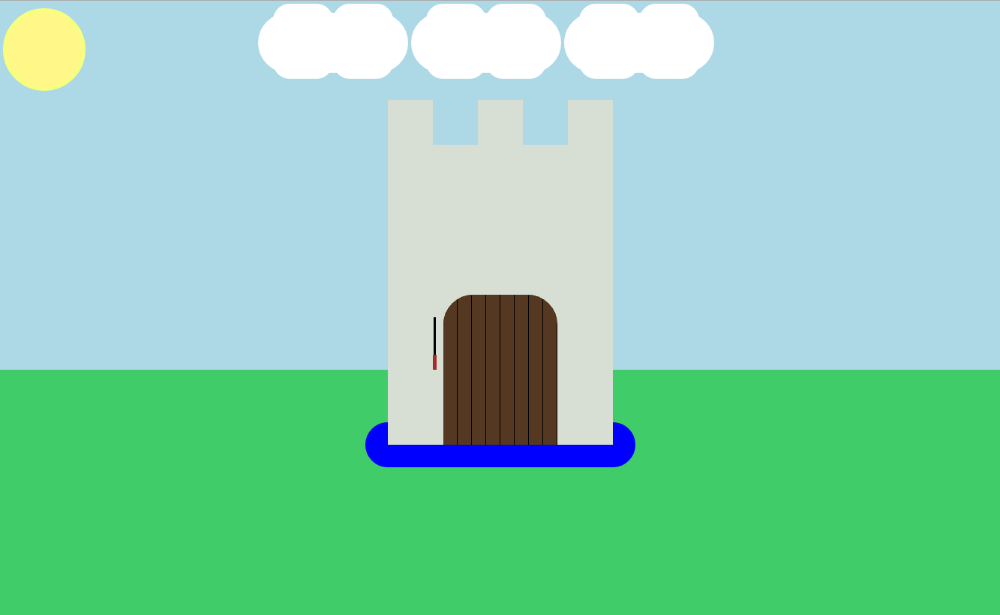

# W02D02 Homework

## Part 1: CSS Castle!

We can do lots of stuff with CSS -- it's pretty powerful! (As we get further in the course, you'll see other ways to style webpages, especially once we get to front-end frameworks. But for now, separate CSS files are the way the majority of webpages are styled.)

We can even "draw" in CSS too.  This castle picture was drawn entirely with CSS:

Your assignment, should you choose to accept it. No, strike that. Your assignment, whether you like it or not, is to recreate that castle above.

In this directory, you'll find
* The castle image itself for reference (*Ethancastle.png*)
* An *index.html* file that **you are not allowed to modify**. I repeat, you must leave index.html alone (although you will want to refer to it constantly!). It contains a bunch of empty HTML elements. You'll notice they've been given classes and/or IDs that suggest their function (e.g., "cloud" or "gate").
* An empty *styles.css* file to contain your CSS.

Modifying only *styles.css*, draw a castle. It should look somewhat like mine, although it doesn't have to match 100% (your colors might be different, or the shape of a cloud slightly changed -- but it should recognizably be the same sort of picture).

HAVE FUN WITH IT!

## VIDEOS

For tomorrow: Watch videos 33, 34, and 35 on Flexbox from Matt Huntington's playlist [here](https://www.youtube.com/playlist?list=PLdnONIhPScST0Vy4LrIZiYKpFNoxgyH7J).

For Thursday: Make sure you've watched videos 1 - 10 on that playlist. (You should have watched 1 - 8 already ...)

Also, from Shorty's playlist [here](https://www.youtube.com/playlist?list=PLw1xVKFbouelUj3g_56CRAUjGGEU13bPF) make sure you've watched videos 92, 93, 94, and 95. Also watch videos 98, 99, 100, and 101. 
