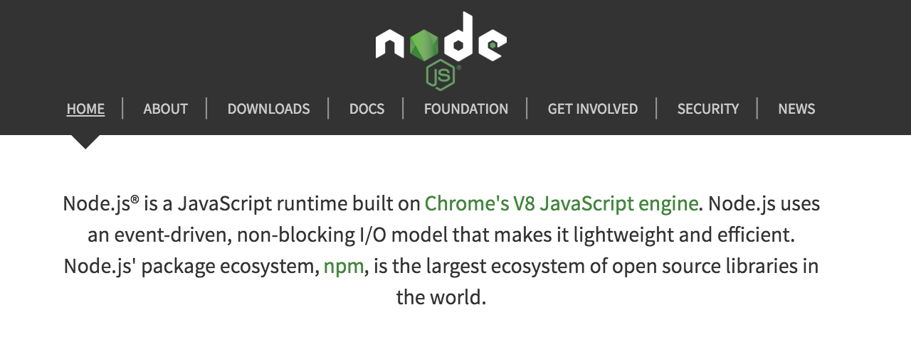
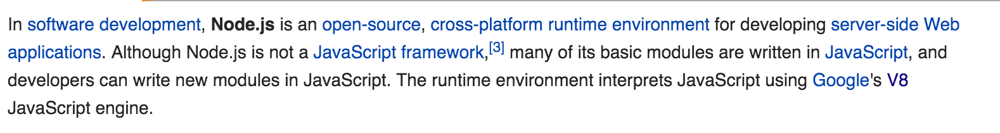
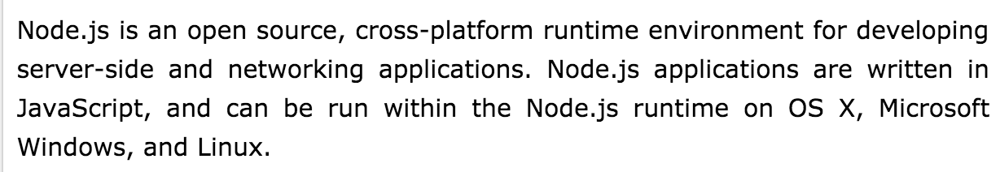

# Intro to Node

### Lesson Objectives
- Define `node.js`.
- Take a look at the `node.js` official docs.
- What is a `REPL`?
- Use a few methods of the module `fs`.
- Define `npm`.
- Use `npm` to install packages.
- What do we use the `package.json` file for?
- Explain the difference between a node `package` & a node `module`.
- Why do we use `modules` in node rather than `.js` files?

---

### Context - web frameworks
- So far we've been using static files (HTML, CSS, JS) to build our websites. *client side*
- But we haven't been able to save data; everything goes away when you refresh the page.
- If we made additional HTML pages, we would repeat a lot of code.
- Why do we need a framework? What does a framework offer us that static files can't?
- Frameworks are the missing puzzle pieces to make a full web app:
- Provide shortcuts, security, organization, a way to store data, and much more.

---

# Part I - What is Node
- Much like trying to define `API`.
  - From the official Node website:
- 
  - From Wikipedia:
- 
  - From TutorialsPoint
- 


### No but really, what is node.
- JS runtime
- JS interpreter
- Runs on Google's `V8 JS engine` (compiles javascript to native machine code)
- Allows you to write server-side code in JS (usually you have to write server-side code using a server-side language, like Ruby or PHP)
- Think about why JS was created. There was only HTML & CSS in the browser; it was created so that some logic could run in the browser. With Node, we'll see a whole lot of other things the language is capable of.
- Node includes a `REPL` built in!
  - `R`ead `E`valuate `P`rint `L`oop
  - Allows you to run JS in your terminal just like you would in your browser's console
  - Also allows you to run a JS file from the terminal
- Other environments that use backend languages like PHP or Ruby block until completion (commands execute after previous commands are completed), but functions in Node are designed to be non-blocking (commands execute simultaneously, and use callbacks to signal completion or failure).
- **Special note about Node:** Node is not by itself a web framework like Rails. The distinction isn't important now, but it's good to know that it's not technically a framework, it's a javascript `runtime`.


---


**Turn & talk:** 2 minutes

Craft a one-sentence definition of `node` in layman's terms.


---


### Some `node.js` history
- Created by Ryan Dahl in 2009
- Later sponsored by Linux & a company called Joyent
- In 2014, a developer (Fedor Indutny) who was unhappy with Joyent's governance of the project started his own fork of node.js called `io.js`.
- Then in Feb. 2015, the two organizations decided to form the `Node.js Foundation` and merge the two projects back together.
- In Sept. 2015, `Node v0.12` merged with `io.js v3.3` ===> `Node v4.0`


---


### Let's play! REPL #1 - JS sandbox
- We can type `node` from anywhere in our terminals to drop into the `repl`
- Let's write a fxn called `addsTwo` that accepts two numbers as parameters. The fxn returns num1 + num2.
- When you call `addsTwo(1,2)`, you should see `3`
- Kaboom! See what happens? It runs your JS right there.


---


**Your turn:**

Write a function called `myName` that accepts one parameter, `theName`. The fxn simply returns the string "My name is `theName`."

* *String interpolation might not work in the repl, so concat the string.*


---


### Let's play! REPL #2 - run a JS file
- Create new folder `node-demos` (you'll make multiple node apps today)
- Inside that, create another folder `repl-node-app`
- Create JS file `index.js`
- In this file, `console.log` some hilariously funny & random text from your favorite `lorem ipsum` [generator](http://mashable.com/2013/07/11/lorem-ipsum).
- Navigate to `repl-node-app` in your terminal; run `node app.js`
- Kaboom! See what happens? It runs your JS right there.


---


**Your turn:**

In `app.js`, write a function `loremThree` that, when called, logs a line of `lorem ipsum` three times. Loops are your friends. The output should look like such:

``` javascript
"Cat ipsum dolor sit amet, lick the plastic bag. Run in terror from cucumber purr for no reason and some tummy rubs."

"Cat ipsum dolor sit amet, lick the plastic bag. Run in terror from cucumber purr for no reason and some tummy rubs."

"Cat ipsum dolor sit amet, lick the plastic bag. Run in terror from cucumber purr for no reason and some tummy rubs."

```


---


### The concept of `modules`
- What's a module?
- Node is built on a `module` system.
- Essentially it's just a way to "package" up JS & use it throughout your app.
- There are **three** types of modules: `core modules`, `packages`, and `custom modules`.
- But what does this mean?! Let's take a look...


---


# Part II - Core Modules
- Core modules are the first type of module we'll talk about. They come with Node. You can use them anytime, anywhere in your app. It's kinda like how your browser ships with a bunch of APIs like SpeechRecognition, you just have to "call" them & they're right there for you, just like friends :) :) :)
- ~35+ modules
- Examples: `File System`, `HTTP`, `Process`, `REPL`
- This is a lot of scary documentation though! Shhh it's ok, let's take a look at how to use one example, the File System module.
- [Node API Docs](https://nodejs.org/api/)

### Example built-in module: File System (fs)
Context about the File System module:
- What is a `file system`? Files on our computer. Remember drawing the file tree on the 1st day of class? That's the `file system`.
- Out in the real world on any website, accessing the file system using a *server-side language* is a regular occurrence.
  - But Javascript isn't a server-side language, oh no!
- Wait, what's the difference between *server-side* and *client-side* languages again?
  - **Server-side**: languages that run on the server (ruby, php, etc).
  - **Client-side**: languages that run on the client, or your browser (HTML, CSS & JS).
- It was considered a major security risk for a web scripting language (javascript) to access the file system, so it wasn't really allowed. There were workarounds but they were difficult.
- But Node allows you to **write server-side code in JS**, therefore letting you to access the file system! Node even has a built-in module that makes it even easier to access the file system & perform standard file operations: File System (fs).
- This is **huge**, this is the whole point of node --- it allows you to write JS on the server side & the client side.

### Actually, this is a great time to talk about the birth of Node.js
Legend has it that Dahl was inspired to create Node.js after seeing a file upload progress bar on Flickr. The browser did not know how much of the file had been uploaded because it couldn't query the file system.


### Let's inspect the `fs` module in terminal:
- Drop into `node`, type in `require('fs')`
  - You get an object back with a bunch of methods
  - I bet we can find those methods in the `fs` [documentation](https://nodejs.org/api/fs.html).

### Let's play with `fs` in our node app & use `fs`'s `.readFile()` method:
- First, find `fs.readFile()` in the Node docs: "Asynchronously reads the entire contents of a file." Perfect.
- Next, `import` the File System module.
- Let's create a file for it to read: `liza.txt` & fill it up with some `lipsum`.
- The `.readFile()` method takes a few parameters: the name of a file, the character set (`utf8`), & a callback fxn.
  - The callback takes two parameters - `error` and `data`.
- Now run `node index.js`.


### Let's play with the `.watch()` method
- Allows us to watch modifications to a specific file in real time.
- Three params: file name, options & a callback.
- Let's tweak `liza.txt` & see what happens!

---
###### ******** Your turn ********
The `readFile()` method:
- In `node-demos`, create `readFile-watch-node-app` and another `app.js` file.
- Create a `.txt` file & fill it up with some lorem.
- In `app.js`, write a `readFile()` fxn that logs the data, prepending it with "HERE IS MY WONDERFUL TEXT:".

The `watch()` method:
- Write a `watch()` method that watches your `.txt.` file that you just created. Run your app, make some changes & see what happens.  

---
### Let's play with the `.writeFile()` method
- We can create our own file!

### Let's play with the `.stat()` method
- Gets some stats about a file, like file size.
- Takes two params: the name of the file & a callback.
- The callback takes two params: error & stats.

---


##### ******** Your turn ********
The `writeFile()` method:
- In `node-demos`, create `writeFile-stat-node-app` and another `app.js` file.
- Use `writeFile()` to create a new `.txt` file & write text in it.

The `stat()` method:
- Use the `stat()` method to get the stats of the new `.txt` file.


---

# Part III - `npm` & packages
- Packages are the second type of module we'll talk about today.
- Difference between `core modules` & `packages`
  - Core modules: built into Node; developed by Node team
  - Package: included by choice; developed by anyone; installed through `npm`
- [Node Package Manager](https://www.npmjs.com/)
- "NPM makes it easier for the community to publish and share open-source Node.js libraries. It is designed to simplify installation & updates of libraries."
- Run `npm`from anywhere in terminal & see what happens
- Run `npm <any command> -h` to see help about that command

### Installing packages
- Installing a package **globally:** `npm install <package name> -g`
  - Run this from anywhere in the Terminal to install a package `globally`
  - The `-g` flag means `global` (long form `--global`)
  - This means it's installed at top level of your computer where `node` itself is installed
  - Why would you install globally? A package you might want to use *not* as a dependency of another app.
- Installing a package **locally:** `npm install <package name> --save`
  - Run this from the top level *of your app*.
  - This installs the package as a dependency in your current project.
  - Installing a package locally means you can only use it in that app.

### The `package.json` file
- This file keeps track of information about your app & any dependent modules.
- Node created an easy way to generate this file; you never have to write it from scratch.
- Run `npm init` from root directory of your project.
- Walk through the prompts in the terminal ---> Produces a `package.json` file for you
- The file looks like a JSON object
- The `scripts` property: write your custom scripts here, such as `"start": "node app.js"` | Now when you type `npm start` into your terminal from the root directory of your project it will run the command `node app.js`
- Any packages you install will automatically be listed here.
- *Note*: If we delete the `node_modules`, we can run `npm install`, which goes through every `dependency` in your `package.json` and installs it. This is helpful if someone pulls your project from GH. They won't need to run the `npm install <package name> --save` command for every dependency.
- *Note*: It is **good practice** to create a `.gitignore` & put `node_modules` in it for the reason listed above.

### Let's play with an npm package: `Prompt`
- Search for "Prompt" on npm's website
- `npm install prompt --save`
- `prompt.get()` method takes two params: an array of info you want to get from the user & a callback.
  - The callback has 2 params: error and result.
- First let's get some basic info from the user
- Then let's take the info & write a new file

### Let's play with `Colors`
- `colors` is a super sweet package that lets you do `prompts` in different colors.
- Search NPM for `colors`
- Install the same way as `prompt`


---


#####******** Your turn ********
Use the `prompt` & `colors` packages:
- In `node-demos`, create `prompt-colors-node-app` directory and an `app.js` file.
- Run `npm init`
- Write a `prompt` that gets the following information from a user:
  - First name
  - Last name
  - Job title
  - Company
  - Age
  - Email
  - Address
  - Hometown
- Write a function that creates a new file using that information, then reads the contents of the new file.
- Refer to the npm colors docs: When you log out the contents of the file, use at least 5 different colors, background colors, & styles (and extras if you're feeling ambitious).


---


# Part IV - Custom Modules
- Custom modules are the third type of module we'll talk about today.
  - Core modules: built into Node; developed by Node team
  - Package: included by choice; developed by anyone; installed through `npm`
  - Custom modules we write ourselves within our app.
- First we write them, then `export` them, then `require` them in other parts of our app where we need them.
- But why do it that way?
- In a static website, write JS in multiple files. We then include `script` tags in our HTML file, which enables us to access what we've written from anywhere in our site. We don't do that in Node.
- Node uses a `modules` system. You write code, package it all up in a `module`, `export` the module, then `require` it in another part of your app.

### Example module:
``` javascript  
// How we would normally write JS in our window.onload fxn:
window.onload = function() {
  var liza = "Liza";
  var sayHello = function() {
    return "hello";
  };
}


/* In customModule.js... */
// In node, write a custom module packaged all up in an object:
var personObject = {
  name: "Liza",
  sayHello: function() {
    return "hello";
  }
}

// export the module:
module.exports = personObject;

/* Then in app.js... */

// Now we require the module from a diff file:
var myPersonObj = require('./customModule.js');

```

### Let's play with the `Cowsay` package
- Search NPM for `cowsay`
- Install `cowsay` globally & locally
- If you install globally, from anywhere: `cowsay "liza"`
- Now let's cowsay `sayings.js`

---


##### ******** Your turn ********
Use the `cowsay` package to do the following:
- In `node-demos`, create a `cowsay-node-app` directory and an `app.js` file.
- Run `npm init`
- In a new file `names.js`, create an array with 10 names; `export` this array.
- In `app.js`, randomly select a name and `cowsay` it to the console every time you run `node app.js`.


---


# Recap:

### Requiring
- Different ways to require modules & packages:

```javascript
/* core module */
var fileSystem = require('fs');

/* package */
// `npm init dj-lazy --save`
var djLazy = require('dj-lazy');

/* custom module */
// First write JS in a diff file. Export that JS in a module.
var sayings = [
  "I’ll cry at the end of the day, not with fresh makeup."
];
module.exports = sayings;

// then require that js file in your main file
var sayings = require('./sayings.js');
```


---


##### ******** Lab time ********
Use the `prompt`, `colors`, & `cowsay` packages & the `fs` module to do the following: Get 5 sage & wise quotes from the user, then randomly select one for the cow to say.
- In `node-demos`, create a `wiseCow-node-lab` directory and an `app.js` file.
- Remember to install & require the modules.
- Create a prompt that asks the user for five quotes by famous & wise people.
- The 5 quotes will be stored in the `result` object of the `prompt.get` fxn.
- Loop over this object (using a `for in` loop) and write the values to a new file called `quotes.txt`
- Loop over the `result` object again, but this time, store the values of each key in an array called `quotesArr`
- Randomly choose a quote from this array for the cow to say.
