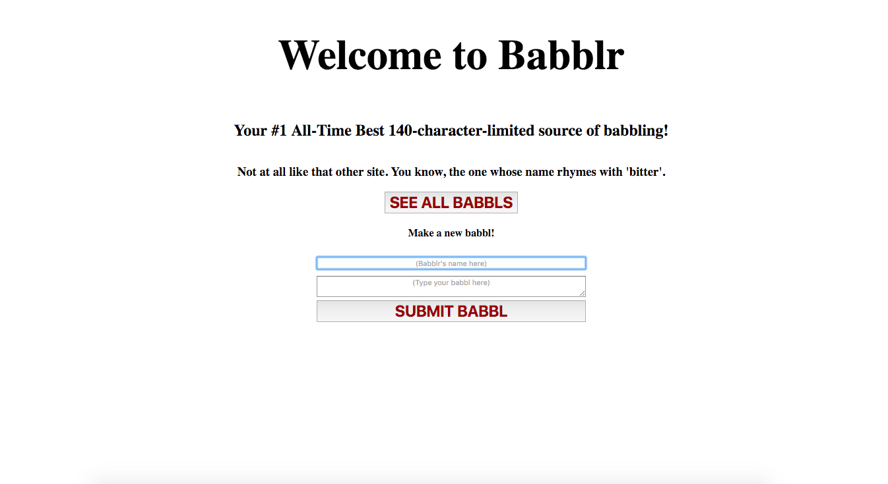
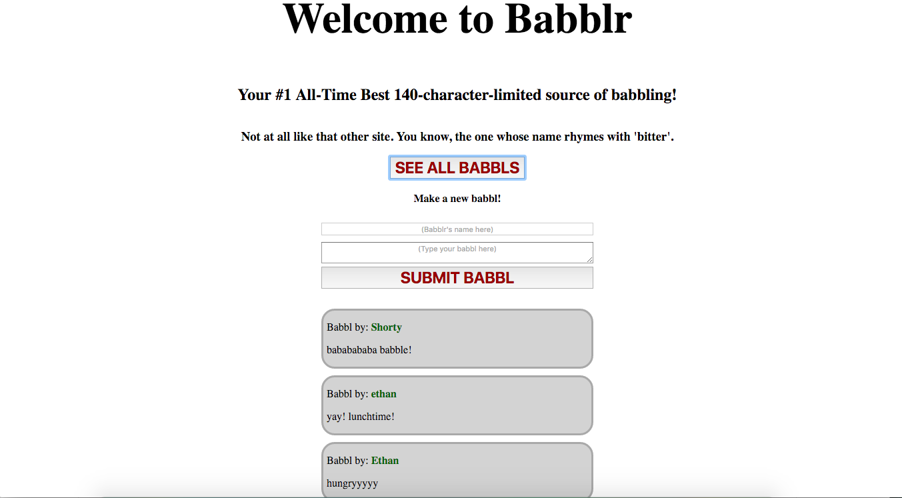

# Let's build our first full-stack app!
## It shall be called .... BABBLR

**NOTE:** Babblr is not at all like that other website, you know, the one that's named after the sounds that little birds make. No relationship at all. None. In fact, for legal protection, you should never ever refer to that other website again. Ever. Or their lawyers will kill you.

## App structure

*Babblr/* this is where the API server will live (app.js)

*babblr/public* (this is where our frontend will live)

*babblr/public/scripts* (front-end JavaScript here)

*babblr/public/stylesheets* (CSS goes here)

*babblr/data* (our "database" goes here)

This is a simplified version of how a typical Express app might be structured. All the files for the frontend live in the /public directory, and front-end JavaScript and CSS files are further segregated into /public/scripts and /public/stylesheets respectively.

Normally, there would be a database (we're going to use MongoDB starting next week) to store our backend data, but here we're simulating with a JSON file in a /data directory.

In the root directory of our app, we have our main server file (app.js) and our package.json.

## Building the App
1. Make a new directory called "babblr". This will serve as your app's route directory. Create the subdirectory structure shown above. You'll need:
babblr/
babblr/data
babblr/public
babblr/public/stylesheets
babblr/public/scripts
If you had, e.g., image and music files to display on your page, those would go in an assets directory in appropriate subfolders. E.g.
babblr/public/assets/images etc.
You should also copy and paste the babbls.json file I've given you here to your babblr/data directory. It has a little starter data in it to get you going.

1. Inside the app's root directory run `npm init` to initialize your new Node app. Confirm you've got a package.json file and a node_modules directory. Create a .gitignore file and write "node_modules" in it.
1. Now let's add in Express. This should feel familiar: `npm install --save express`.
1. We're going to need to be able to serve up JavaScript from anywhere, so we're going to want the `cors` module as well. Install it just like you did with express.
1. One other handy module that we're going to install (don't do it yet! -- finish reading this paragraph!) is `nodemon`. [Nodemon](http://nodemon.io/) will monitor your backend code, and whenever you make changes that would require re-starting the server to implement, it will do so for you automatically! Very handy. You don't have to constantly stop your Express server and re-run `node app.js` to get it going again. Instead you're just going to run `nodemon`, and it will automatically start and re-start your server as necessary. Since nodemon is something that will only be needed when an app is in development, not in actual production, we're going to install it as a development dependency. This isn't necessary; you could install it as a regular dependency if you want, but it's good practice to segregate them out that. You can read more about dependencies and dev-dependencies [in the npm docs](https://docs.npmjs.com/files/package.json#dependencies). So now run `npm install --save-dev nodemon` to get it installed. (If you've already installed nodemon as a global dependency using `npm install -g nodemon` you won't need to use this step.)
1. If you inspect your package.json now, you should see express and cors as regular dependencies and nodemon as a dev dependency. (If nodemon is a global dependency it won't appear in your package.json.)
1. Let's get started! We'll begin with the backend first, since that's the part that's newest to us. Open up your app.js file. At the top, you'll need to require express, fs (filesystem -- the core module), and cors. And you'll need to run express to create a new app. This should look semi-familiar from today's class already:   
    **DON'T JUST COPY AND PASTE THIS CODE -- TYPE IT YOURSELF!**
    ```js
    var express = require('express'),
    cors    = require('cors'),
    fs      = require('fs'),
    app     = express();
    ```
    (Note you could use four separate lines of code and `var` declarations to do this; the above is just my personal way of writing it. Go with whatever floats your boat.)

1. We need to add in the ability to send ajax requests to our server from anywhere! That means we'll need to add some middleware to ensure that on every request, the server is using `cors` to handle that.  You'll need to add in a line of code: `app.use(cors());` to ensure that. Remember that the .use function in express is a piece of middleware that will run on every request, no matter what type of HTTP request it is or to what path it's going. You can read more about middleware [here](http://expressjs.com/en/guide/using-middleware.html) if you're curious.
1. We're going to need two routes in our router. One to handle GET requests to root ('/') and one to handle POST requests to root ('/'). Here's the starting framework for the GET('/') route; I'll leave you to write the similar framework for the POST('/') route entirely by yourself.
`app.get('/', function(request, response) {//stuff goes here});`
Remember there are two parameters passed into the .get function: the first is the path for the route, and the second is the callback function to execute when a matching HTTP request is received. (In this case a GET request to '/'). For the moment, just console.log('incoming GET request') inside the body of the callback. **Do the same thing for a POST route to '/'**. (change the console.log accordingly).
1. Once you've done that, we need to actually start up our server. I'm going to suggest we do this slightly differently than Syed did it in his in-class demo. Add a new variable at the top of your app called PORT. It's a constant so make it ALL CAPS. Set it equal to 3000. This is handy because later, if you need to change the port your app is operating on, you can set that right at the top instead of searching for the function where you start your server listening. Also, later on, when we start deploying apps to the interwebs, we'll change that code to read something like
`var PORT = process.env.PORT || 3000` which is the equivalent of saying "set PORT equal to the value of the environmental variable named PORT, or, if that doesn't exist, to 3000."
1. Now we need to start our server listening using `app.listen`. app.listen() takes two parameters, the first the port to start listening on (here, `PORT`), and the second is a callback function. Inside your callback, let's just write
`console.log("server is up and running on port", PORT);`
1. Cool! if you go to your terminal, go to your app's directory and `node app.js` you should see `server is up and running on port 3000` in your terminal. WOOHOO! **STOP** now and add and commit your code if you haven't been all along.
1. Now quit your server, and instead of running `node app.js` run `nodemon` instead. You'll see it then starts your server for you. It's now monitoring your app.js file for changes, and will restart your server when it detects them. Try it out -- add in a new console.log somewhere in app.js and save the file. If you look at your terminal window where you're running nodemon it should say something like
   ```
   [nodemon] restarting due to changes...
   [nodemon] starting `node app.js`
   ```

1. Alright let's switch back to the front end and build it out a bit. Inside your `public` directory, create an index.html. Inside public/scripts, you'll need a main.js file, and in public/stylesheets, you'll need styles.css.
1. Once those are made, open up index.html, and create the basic skeleton of a webpage. Make sure to link in your stylesheet (use the path `stylesheets/styles.css` to get to it) and to load up your JavaScript in a script tag at the bottom of the page's `<body>` (remember that the script is in a `/scripts` subdirectory so the path won't be just the filename).  We'll also need jQuery, so why don't you go ahead and grab it from a CDN like usual and add it to your page. Put a console.log message in your main.js file, write 'hello world' in the body of the html, and add some simple styling in your css (like giving the body a background color, say), and open the file directly from the browser. Make sure that you're seeing "hello world" on a colored background, and that if you inspect the console, you see the message indicating the JavaScript file was loaded successfully. (Now you can get rid of the 'hello world' and background.)
1. OK, let's get cracking. We're going to create 'Babblr' because I've got a six-month old and (a) babies babble all the time and (b) I think "babbling" is a better description of 99% of the content of Twitter than "tweeting" is.  Your page will need:
  * suitable headers at the top
  * a button to click to view all the babbls
  * a couple input fields to create new babbls. One should be a text input (for the author of the babbl), and the other a textarea input (for the babbl itself). Note that you can use some built-in validation on the textarea input. We don't want our babbls to be longer than 140 characters! So give your `<input type="textarea">` element the following property: `maxlength="140"`.
  * a button to click to submit your new babbl.
Here's a screenshot of what mine looked like with absolutely *minimal* styling (i.e., just enough to not have everything be left-aligned).
   

1. Once you've done the above, make sure to give each of your buttons suitable ids so we can easily grab them in the JavaScript. Put *just* enough styling on the page for now that it doesn't actively make you want to vomit.
1. Now let's give our page some life! In main.js, we're going to need two event listeners, both click handlers. One will have to be on the 'see all babbls' button and the other on the 'submit babbl' button. Go ahead and write those. Inside each event listener's callback, just put a console.log and make sure that when you click the button you're seeing the log. You can use vanilla JavaScript or jQuery to grab the elements from the DOM and create the click event listeners -- your choice.
1. Let's start with the "see all babbls" button since the backend code is going to be a little simpler for this. On the frontend, when we click the button we need to submit a GET request to the server to the root path ('/'). jQuery actually has a shorthand `$.getJSON` method, so let's use that! Syntax is `$.getJSON(url, callback)`. Nice and crisp. Now, we're going to be using http-server to serve up our front-end page, but our back-end API server will be running off of Express. If you remember when we wrote the starter backend code above, we set the server's port to be 3000. So the url for our $.getJSON function will be `'http://localhost:3000/'`. The callback function should take a parameter; call it `result` or `data` or whatever you want. For now, just console.log the value of `result` inside the callback.
When we created the server route up above, in app.js, we put a console.log in the GET('/') route. Let's make sure we're seeing that in the terminal. Inside your public directory, run `http-server`. It should tell you it's up and running on Port 8080. Inside your main babblr directory, in a different Terminal window, make sure `nodemon` is running so that your back-end API server is up on Port 3000. Open up your browser and go to http://localhost:8080. It should load up your webpage. And clicking on the 'get all babbls' button won't do anything on the frontend yet (because we haven't written the backend code to catch the request, handle it, and send data back) BUT if you view the terminal window where your node server is running, you should see the console.log of 'incoming GET request' that we started up earlier. If you get that, awesome! Then STOP. Add and commit your code in git.
1. OK, pop back over to app.js and let's get the backend for this route up and running. When the server receives a GET request to the root path ('/') we want it to
  1. read the babbls.json file in the data/ directory (I have included a sample babbls.json here in this directory that you can use to give yourself some starter babbls -- or feel free to write your own instead!)
  1. send that data back to the client
We're going to use the built-in filesystem module (fs) to read the babbls.json file in our data/ directory. So you should know how to do that now. Inside the app.get('/') callback function, call `fs.readFile('./data/babbls.json', 'utf8', function(error, data) { // code here })`.  Inside THAT callback (callbacks inside callbacks inside callbacks--very *Inception!*), you should always put in error handling first. Add in an `if` statement that looks to see if there was an `error` passed in, and if so logs it to the console. If there's no error, then we want to send the `data` that we read from our file back to the client. Just like in the in-class demo, we can use `response.json(data)` to that. So put that inside your callback. Almost there! Make sure both servers are up and running, refresh the page in your browser, and click the 'see all babbls' button. If you look in your browser's console, you should see the console.log of the data that was received from the server -- it should be the contents of babbls.json. If you see it, congrats!
1. This next part I'm not going to do for you -- you should be old hands at this. You just hit up an API successfully (only this time it was your own API that you built!) and got some JSON back. To render it to the DOM, you may use your choice of:
  * jQuery
  * vanilla JS
It doesn't have to look pretty -- we're not worrying about styling tonight! But it should display a list of babbls, each one with an author and the content of the babbl. Here's what mine looked like:
   

1. If you've got to this step and everything's working you should be so proud. If you haven't added and committed your code since you built the initial frontend code way up above, do so now. Try to remember: ~15 minutes of work = one commit. Or another way of thinking about it, you've gotten a single function working properly? Then `git add` and `commit`. Then keep coding.
1. Now let's build our second route so we can actually create a new babbl. Start on the frontend. In main.js you'll need a click event listener on the submit new babbl button. You should have set this up already, but do so now, and confirm it triggers a console.log on a click. Inside the callback for the event listener we will need to do the following
  * grab the values of the author input and the babbl input.
  * create a new object with "author" and "babbl" properties, set equal to the values you grabbed from the DOM
  * Make a $.POST request (annoyingly, jQuery does *not* have a shorthand $.postJSON function) to ('/'), passing in the object you just created as the data of the request.

   Here's what the $.POST should look like:
   ```js
   $.POST({
      url: 'http://localhost:3000/',
      data: //[the name of your data object goes here],
      dataType: 'json'
   })
   ```
   Add in a `.done` function to your POST that will console.log the data that it gets back.

24. Try writing a new babbl and clicking submit. If you go over to your server's terminal window, you should see the console.log you created on the backend in app.js in the app.post('/') route way up near the start of the homework. (If you didn't create that console.log, do it now.) If you're seeing it, congrats! Your server successfully received the POST request. Add and commit your code.
1. So now we need to actually grab the data from the request. To do this, we're going to use another npm package called 'body-parser' which will, shockingly, parse the body of the request for what the frontend code shoved in there. So up at the top of your app.js file, add in `var bodyParser = require('body-parser')` and of course, in the terminal run `npm install --save body-parser` to get it added into our node_modules.
1. In app.js, below our `var` declarations (where we ran `app.use(cors())`) let's add in another piece of middleware to use body-parser on all requests. Add in `app.use(bodyParser.urlencoded({extended:true}))`.
1. OK, now that we can parse the body of the request, let's do that. Inside the callback for your POST route (the app.post function you made at the beginning of this HW), add in a line like this: `var newBabbl = request.body`. Try running a console.log(newBabbl) to make sure you're successfully grabbing the submitted data from the body of the request.
1. Now that we have the babbl that was sent over from the client, we need to do the following:
    1. Read our babbls.json file like before, parse the JSON (JSON.parse), and store the result in a variable. Then in the callback inside `fs.readFile`:
    1. Add the new babbl, that you stored in `newBabbl` in the prior step, to that object.
    1. Turn the object back into JSON by using `JSON.stringify`.
    1. Use `fs.writeFile` to overwrite our babbls.json file with the new object which now includes our brand-new babbl that the user just submitted. (You should be testing each of these steps out with console.logs as necessary to make sure everything's working.)
    1. In the callback inside fs.writeFile the final step is to send something back to the client. For now, just send back `response.json({"success":"true"})`.
WHEW! If you got all this working sucessfully then you should be able to
  * load up your webpage.
  * Make a new babbl and click submit
  * Send the babbl to the API server (localhost:3000)
  * Catch the request on the other end, grab the babbls from our "database" (babbls.json), parse them into JavaScript, add the new babbl, reconvert the babbls to JSON, write them to the "database", and send a response back to the client.
1. On the frontend, add in a .success or a .done function that console.logs what comes back from the API if you didn't already. Submit a new babbl and you should see `{"success":"true"}` in your browser's console!
*CONGRATULATIONS! HAVE A DRINK! HAVE THREE!*
1. **TO SUBMIT THIS HOMEWORK:**
  * In your homework issue, rate how many steps out of the 29 above you have completed successfully. **A completed homework must have at least through step 22 working.** If you completed any of the bonuses below, indicate which ones.
  * In addition, in your issue, answer the following questions:
    - Do you have a working backend server that is capable of listening for incoming requests, checking to see if they match any routes you've specified, and taking action accordingly?
    - Is your server capable of both reading your "database" (i.e., your babbls.json file) and writing to it?
    - Do you have a working frontend that displays content on the page?
    - Is your frontend capable of making an AJAX GET request to your backend when the 'view all babbls' is clicked, and does the backend in return send over the contents of the babbls.json file, which the frontend can successfully display?
    - Is your frontend capable of grabbing the contents of the input fields when you click on the 'submit new babbl' button, making a POST request to your backend, which in turn successfully writes the new babbl to the file?
    -HW GUIDELINES FOR EVERYONE:
      - **Due at midnight** (unless you prefer to do it early in the morning, then it must be done before class starts)
      - If you want more time, talk to us first, then you have **2 days** to turn it in at midnight. After that, it's either done or not done & that's the end of it. This should happen very rarely. *Late homeworks do not receive feedback.* 

### **BONUSES**
1. Make sure your babbls are displaying so that the newest babbl appears at the top, and then downward in descending chronological order.
1. Instead of just sending {"success":"true"} back on the successful creation of a new babbl, send the client the full list of babbls (including the newest one), and on the front end make it so that it displays all those babbls right away. I.e., when you click 'submit new babbl', your web page should automatically update with the full list of babbls including the one just created.
1. Read up on the JavaScript global Date object [here](https://developer.mozilla.org/en-US/docs/Web/JavaScript/Reference/Global_Objects/Date). When you make a new babbl object in app.js, also add in a 'Created' property. It should be the date and time; you might want to check out the Date.toLocaleString() method. Add in to your babbl display, the date/time of the babbl's creation along with the author and content.
1. Add in the ability to search the babbls for all those by a specific user and only display those.
1. Add in some additional validation to prevent users from trying to get around the 140-character limit. Ideally, you should be validating the user input in three places:
  1. In the HTML (where possible) with validators such as the `maxlength` attribute
  1. In the frontend JavaScript. You could only create the new babbl if the length of the babbl <= 140 characters. If it's more, display a 'babbl is too long'-type message and refuse to post the new babbl.
  1. In the backend JavaScript, the server should refuse to write the new babbl to the database if the babbl body is too long as well.
  1. In addition to validating maxlength you could validate minlength as well. Make sure that you can't submit an empty babbl. Also, you could make sure the author field  can't be blank.
