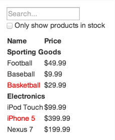

# W07D02 homework

## So when I searched giphy for "react" GIFs, I got these two, which seemed apropos of how you're probably feeling right now:


##The Homework

###Part 1: Breaking a site into components

Go to [xkcd.com](www.xkcd.com) -- if you don't know it, it's an awesome comic by a techie! Always fun.

I would like  you to diagram out how you might break the site up into React components.

For example, if I wanted to diagram out Google's homepage:


I might do it like this (there's no one right way!), as a nested list (child components live within parent components)

* Main (or app) -- holds everything
  - nav (or header) -- holds the top navbar and the static content (the "images" link and the apps icon (the nine little boxes))
    - dynamic nav content (username, mail [if you're not logged in it, it says "gmail" and links to the generic gmail website], and user image would probably be their own components)

  - mainContent -- holds all main content (header, search bar, buttons)

  - footer
    * footerNav (left footer nav with Advertising, Business, About)

    * footerNav (right footer nav with privacy, terms, settings)

    (it could also just be one footer nav with six items in it, the first three syled to the left and the others to the right; which you'd choose depends on how your site works)

Head over to xkcd and do the same thing; save it in a markdown.

###Part 2: React concepts

1. What is a component?

2. What is JSX?

3. What function do I use to create a component?

4. What does Webpack do?

5. What are props?

6. What is state?

7. What's the one method every React component must have (hint: it rhymes with "bender") and what does it do?

###Part 3: React 101

We want you to build a *static* version of the silly sporting goods / electronics store shown on the website Liza linked to in class. **DO NOT USE THEIR CODE. HOMEWORK THAT USES THE ARTICLE'S CODE WILL NOT BE ACCEPTED; IT WILL BE CONSIDERED PLAGIARISM.**

Here's a screenshot of the store:



Build up the store from React components.

Here's the data our backend API server returned to us:


```js
var products =
[
  {
    category: "Sporting Goods",
    price: "$49.99",
    stocked: true,
    name: "Football"
  },
  {
    category: "Sporting Goods",
   price: "$9.99",
   stocked: true,
   name: "Baseball"},
  {
    category: "Sporting Goods",
    price: "$29.99",
    stocked: false,
    name: "Basketball"
  },
  {
    category: "Electronics",
    price: "$99.99",
    stocked: true,
    name: "iPod Touch"
  },
  {
    category: "Electronics",
    price: "$399.99",
    stocked: false,
    name: "iPhone 5"
 },
  {
    category: "Electronics",
    price: "$199.99",
    stocked: true,
    name: "Nexus 7"
 }
];
```
